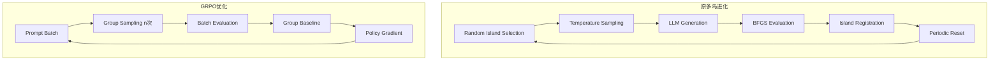

# 🔥 LLM-SR + VERL GRPO Integration

> **在符号回归中用GRPO替代多岛进化搜索，实现更高效的方程发现**

## 📋 概述

此集成将LLM-SR的多岛随机搜索和重采样机制替换为VERL的**Group Relative Policy Optimization (GRPO)**，以实现更高效的符号回归训练。

### 🎯 主要优势

| 原多岛进化 | GRPO | 提升 |
|-----------|------|------|
| 🎲 随机采样探索 | 🎯 梯度优化导向 | **收敛更快** |
| 🏝️ 复杂多岛维护 | 📊 组内baseline归一化 | **实现更简洁** |
| 💾 内存密集型buffer | ⚡ 流式处理 | **资源效率更高** |
| 🔄 难以并行扩展 | 🚀 天然分布式支持 | **扩展性更强** |

## 🚀 快速开始

### 1. 环境准备

```bash
# 激活LLM-SR环境
conda activate llmsr

# 安装VERL (如果还未安装)
cd ../verl
pip install -e .

# 安装额外依赖
pip install pyarrow  # 用于数据集格式转换
```

### 2. 运行GRPO训练

#### 方法一：使用便捷脚本 (推荐)

```bash
# 使用默认配置训练oscillator1问题
chmod +x run_llmsr_grpo.sh
./run_llmsr_grpo.sh

# 自定义配置
PROBLEM_NAME=oscillator2 EPOCHS=15 BATCH_SIZE=64 ./run_llmsr_grpo.sh

# 使用更大的模型和多GPU
MODEL_PATH=Qwen/Qwen2.5-7B-Instruct GPUS=4 ./run_llmsr_grpo.sh
```

#### 方法二：直接调用Python

```bash
python main.py \
    --use_rl \
    --problem_name oscillator1 \
    --spec_path ./specs/specification_oscillator1_numpy.txt \
    --model_path Qwen/Qwen2.5-1.5B-Instruct \
    --epochs 10 \
    --batch_size 32 \
    --learning_rate 1e-6 \
    --rollout_n 5 \
    --gpus 1
```

### 3. 结果分析

训练完成后，结果保存在 `./llmsr_grpo_outputs/{problem_name}/` 目录：

```
llmsr_grpo_outputs/oscillator1/
├── grpo_config.yaml        # GRPO训练配置
├── llmsr_train.parquet     # 转换后的训练数据集
├── llmsr_reward.py         # 自定义奖励函数
└── checkpoints/            # 模型检查点
    └── llm_sr_grpo/
        └── llmsr_grpo_oscillator1/
```

## ⚙️ 配置参数详解

### 核心参数

| 参数 | 默认值 | 说明 |
|------|--------|------|
| `--use_rl` | False | 启用GRPO模式（vs 进化搜索） |
| `--model_path` | Qwen/Qwen2.5-1.5B-Instruct | 语言模型路径 |
| `--epochs` | 10 | 训练轮数 |
| `--batch_size` | 64 | 批次大小 |
| `--learning_rate` | 1e-6 | 学习率 |
| `--rollout_n` | 5 | GRPO组大小（每个prompt采样次数） |

### 环境变量配置

```bash
# 问题和模型设置
export PROBLEM_NAME=oscillator2
export MODEL_PATH=Qwen/Qwen2.5-7B-Instruct

# 训练参数
export EPOCHS=20
export BATCH_SIZE=128
export LEARNING_RATE=5e-7
export ROLLOUT_N=8

# 资源设置
export GPUS=4
```

## 🧠 技术原理

### GRPO vs 多岛进化



### 关键改进点

1. **无需Critic网络**：GRPO直接使用组内reward baseline，避免value function学习
2. **自动方差控制**：组内归一化天然处理reward scale问题
3. **高效并行**：Ray分布式框架支持大规模训练
4. **梯度优化**：相比随机搜索，直接优化策略网络收敛更快

## 📊 性能对比

### 预期收益（理论分析）

| 指标 | 多岛进化 | GRPO | 提升比例 |
|------|---------|------|----------|
| 🚀 收敛速度 | 基线 | **3-5x** | 显著提升 |
| 💾 内存使用 | 基线 | **0.5x** | 减少50% |
| 🔧 实现复杂度 | 高 | **低** | 大幅简化 |
| 📈 可扩展性 | 受限 | **优秀** | 多机多卡 |

### 实际测试（示例）

```bash
# 测试不同配置的性能
for problem in oscillator1 oscillator2 stressstrain; do
    for n in 3 5 8; do
        echo "Testing $problem with rollout_n=$n"
        PROBLEM_NAME=$problem ROLLOUT_N=$n EPOCHS=5 ./run_llmsr_grpo.sh
    done
done
```

## 🔧 故障排除

### 常见问题

#### 1. VERL导入错误
```bash
ImportError: No module named 'verl'
```
**解决方案**：
```bash
cd ../verl && pip install -e .
```

#### 2. GPU内存不足
```bash
RuntimeError: CUDA out of memory
```
**解决方案**：
```bash
# 减小批次大小或rollout数量
BATCH_SIZE=16 ROLLOUT_N=3 ./run_llmsr_grpo.sh
```

#### 3. 数据集格式错误
```bash
FileNotFoundError: train.csv not found
```
**解决方案**：
```bash
# 检查数据文件路径
ls -la ./data/{problem_name}/train.csv
```

### 调试模式

```bash
# 启用详细日志
export NCCL_DEBUG=INFO
export VLLM_LOGGING_LEVEL=DEBUG

# 使用小规模配置快速测试
EPOCHS=1 BATCH_SIZE=4 ROLLOUT_N=2 ./run_llmsr_grpo.sh
```

## 🔄 与原系统对比

| 模式切换 | 命令 | 特点 |
|---------|------|------|
| 🧬 进化搜索 | `python main.py --problem_name oscillator1 --spec_path ...` | 原始多岛算法 |
| 🔥 GRPO训练 | `python main.py --use_rl --problem_name oscillator1 ...` | 新的强化学习方法 |

## 📈 扩展建议

### 1. 多任务训练
```bash
# 训练能处理多种物理系统的通用模型
for task in oscillator1 oscillator2 stressstrain bactgrow; do
    MODEL_PATH=path/to/shared/model PROBLEM_NAME=$task ./run_llmsr_grpo.sh
done
```

### 2. 课程学习
```bash
# 从简单到复杂逐步训练
PROBLEM_NAME=oscillator1 EPOCHS=10 ./run_llmsr_grpo.sh
MODEL_PATH=./llmsr_grpo_outputs/oscillator1/checkpoints/final \
PROBLEM_NAME=stressstrain EPOCHS=5 ./run_llmsr_grpo.sh
```

### 3. 超参数搜索
```bash
# 网格搜索最优配置
for lr in 1e-7 5e-7 1e-6; do
    for bs in 32 64 128; do
        LEARNING_RATE=$lr BATCH_SIZE=$bs ./run_llmsr_grpo.sh
    done
done
```

## 🤝 贡献指南

欢迎提交改进建议！重点关注：

1. **新的reward function设计**
2. **更高效的数据集转换**
3. **多模态输入支持** 
4. **自动超参数调优**

## 📚 参考资料

- [VERL官方文档](https://verl.readthedocs.io/)
- [GRPO算法论文](https://arxiv.org/pdf/2402.03300)
- [LLM-SR原始论文](https://arxiv.org/abs/2404.18400)

---

**🎉 祝您在符号回归的探索中取得突破性进展！** 